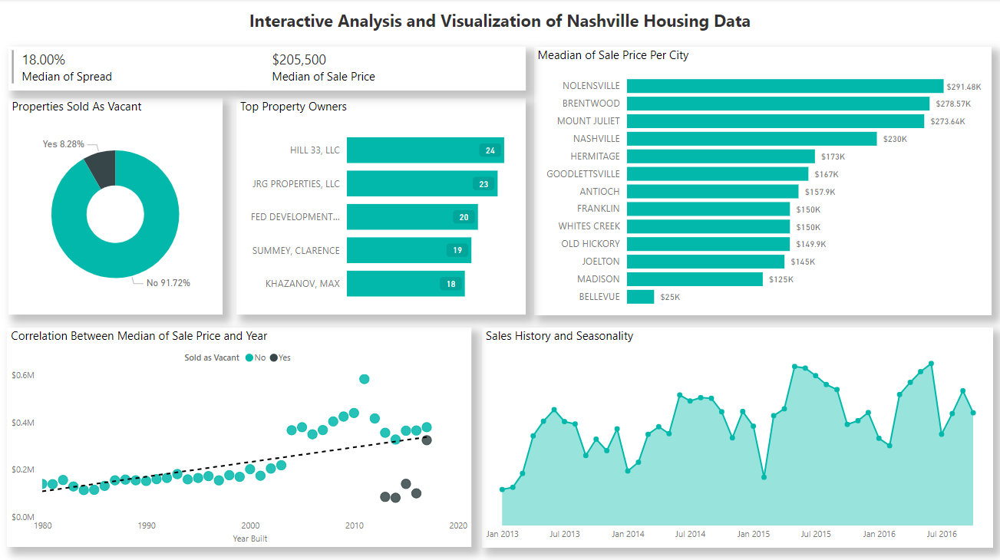

# Nashville Housing Data Project

The primary goal of this project was to clean and organize data from the Nashville Housing Dataset, available in the repository, and visualize this data using Power BI. This project allowed me to apply various data analysis techniques, including:

- Joins  
- CTEs  
- Temporary Tables  
- Aggregate Functions  
- Data Type Conversion  
- Updates  
- Data Visualization with Power BI  

### Data Cleaning and Transformation

The project began with cleaning the raw dataset. The Excel file was imported into SQL Server, and I started with simple `SELECT` statements to understand its structure.

```sql
SELECT *
FROM PortfolioProject..Nashville;
```

During the initial exploration, I identified inconsistent date formats. To resolve this, I standardized the date fields, making them consistent and more usable for analysis.

```sql
UPDATE Nashville
SET SaleDateConverted = CONVERT(Date, SaleDate)
```

Additionally, I observed that the `PropertyAddress` column contained null values. Since each property had a `ParcelID`, I inferred that properties with the same `ParcelID` shared the same address. Using this logic, I updated the null values in `PropertyAddress` to match the corresponding `ParcelID`.

```sql
SELECT NashA.ParcelID, NashA.PropertyAddress, NashB.ParcelID, NashB.PropertyAddress, ISNULL(NashA.PropertyAddress, NashB.PropertyAddress)
FROM PortfolioProject..Nashville NashA 
JOIN PortfolioProject..Nashville NashB
	ON NashA.ParcelID = NashB.ParcelID
	AND NashA.[UniqueID ] <> NashB.[UniqueID ]
WHERE NashA.PropertyAddress IS NULL

UPDATE NashA
SET PropertyAddress = ISNULL(NashA.PropertyAddress, NashB.PropertyAddress)
FROM PortfolioProject..Nashville NashA 
JOIN PortfolioProject..Nashville NashB
	ON NashA.ParcelID = NashB.ParcelID
	AND NashA.[UniqueID ] <> NashB.[UniqueID ]
WHERE NashA.PropertyAddress IS NULL
```

I further enhanced the dataset by splitting the information in `PropertyAddress` into `City` and `Address` columns. A similar approach was applied to the `OwnerAddress` column. Utilizing the `PARSENAME` and `REPLACE` functions, I separated these details to enrich the data for visualization.

```sql
UPDATE Nashville
SET OwnerSplitAddress = PARSENAME(REPLACE(OwnerAddress, ',','.'), 3);
```
To finalize the data cleaning, I removed duplicate values and deleted unused columns, ensuring the dataset was concise and ready for analysis.

```sql
---- Remove Duplicates

WITH RowNumCTE AS(
SELECT  *,
		ROW_NUMBER() OVER(
		PARTITION BY ParcelID,
					 PropertyAddress,
					 SalePrice,
					 SaleDate,
					 LegalReference
					 ORDER BY UniqueID
					 )row_num
FROM PortfolioProject..Nashville
)

DELETE
FROM RowNumCTE
WHERE row_num > 1

---- Delete Unused Columns

ALTER TABLE PortfolioProject..Nashville
DROP COLUMN OwnerAddress, TaxDistrict, PropertyAddress, SaleDate
```

The full SQL script used for data cleaning can be accessed in the repository.

### Dashboard Development

To prepare the data for visualization, I exported the cleaned data from SQL Server into two CSV files. This approach allowed me to practice connecting tables in Power BI.

Using Power BI, I tested various dashboard visualizations and created a final dashboard showcasing key insights from the dataset.



### Key Insights

Analyzing the data with SQL and Power BI revealed several important patterns:

- **Correlation Between Year Built and Sale Price**: Newer houses had higher sale prices. Additionally, houses sold as vacant were typically sold in the same year they were built, suggesting these properties were likely pre-construction sales.
- **Top Property Owners**: The data indicated that the majority of top property owners were companies.
- **Median Sale Price Per City**: Nollensville had the highest median sale price.
- **Sales History and Seasonality**: While sale prices have been increasing, seasonal trends showed peaks in June, with November and February experiencing the lowest sales.

This project provided valuable experience in data cleaning, transformation, and visualization, enhancing my skills in SQL and Power BI. You can explore the project files and dashboard in the repository.
